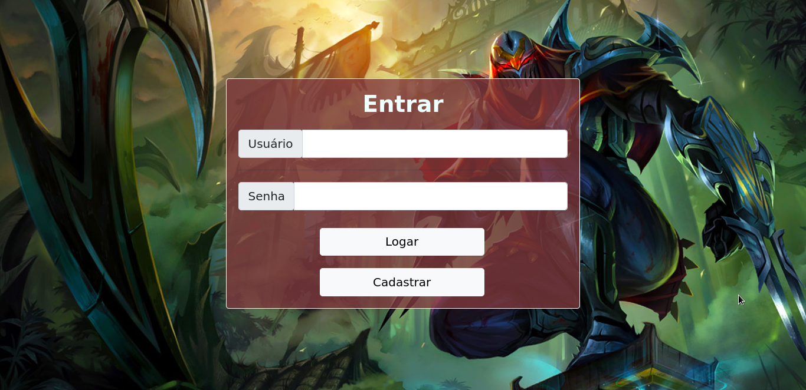
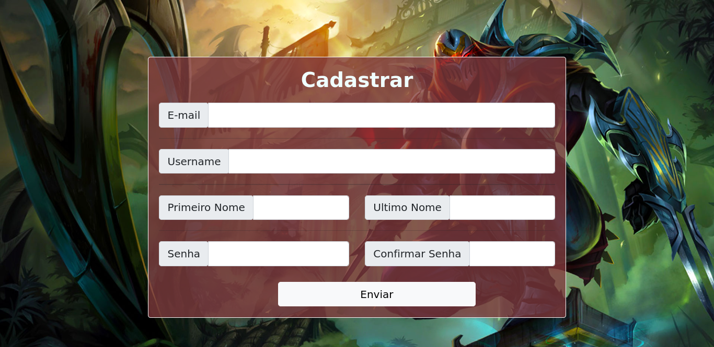
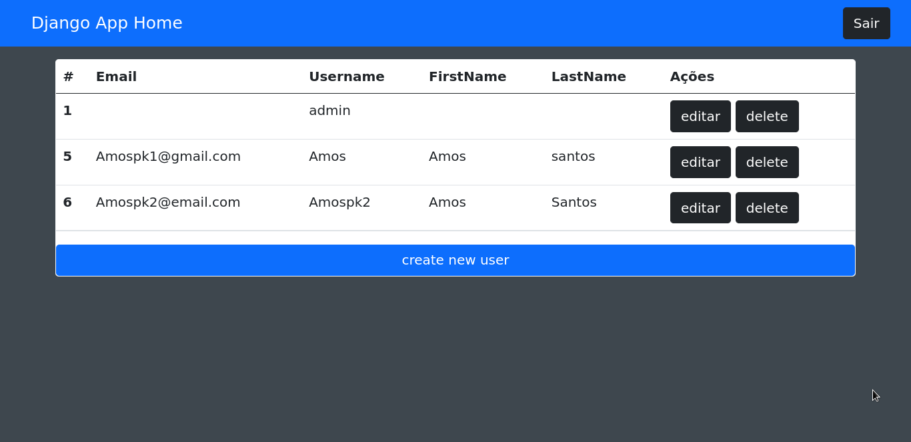
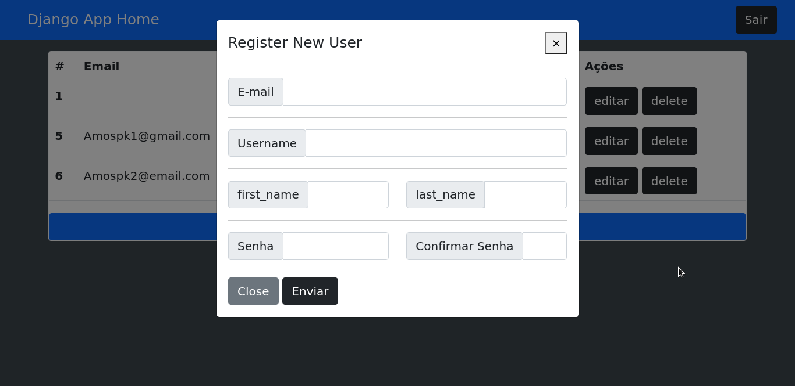
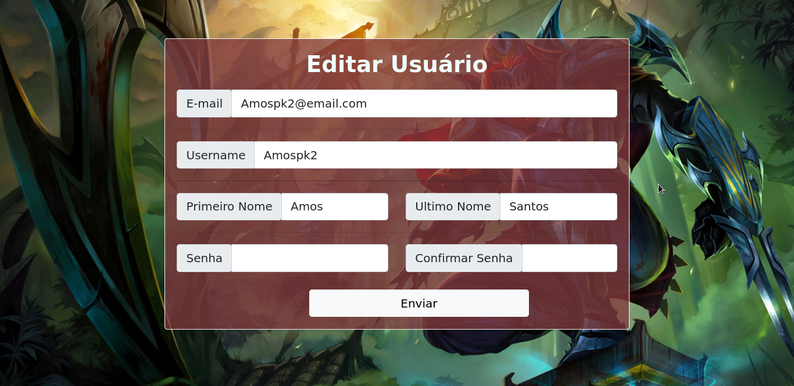

# CRUD feito em Django!

Com o objetivo de estudar e praticar, criei esse crud que realiza o cadastro de usuário, administra o login do mesmo no sistema, edita suas informações e tambem deleta usuários do sistema.

## Instruções:

-**Para rodar o projeto na sua maquina, primeiro faça o clone:**

- `git clone https://github.com/Amospk2/django_crud.git`

**Agora no terminal, aplique as migrations do projeto:**

- `python3 manage.py migrate`

**Para inicializar o projeto:**

- `python3 manage.py runserver`

# Login

# Cadastro

# Home

# Register New User

# Editar

